# vscode一条龙服务

## vscode 启动SpringBoot项目

默认已经安装了JDK，数据库，Maven

没装的可以上网搜教程

### 安装Java插件

vscode 插件搜索Java即可。

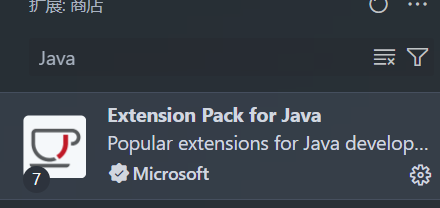

### 安装SpringBoot插件

vscode 插件搜索Spring即可。

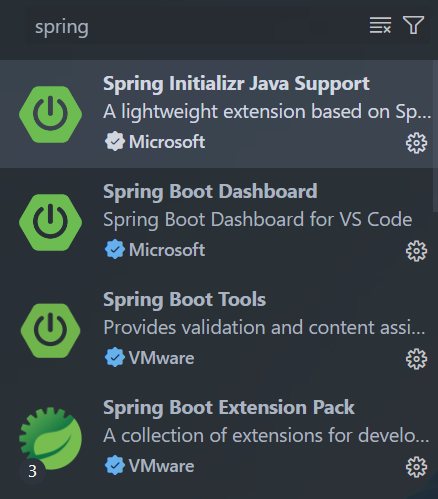

### 创建SpringBoot项目

按住 ctrl + shift + p，输入Java: Create Java Project

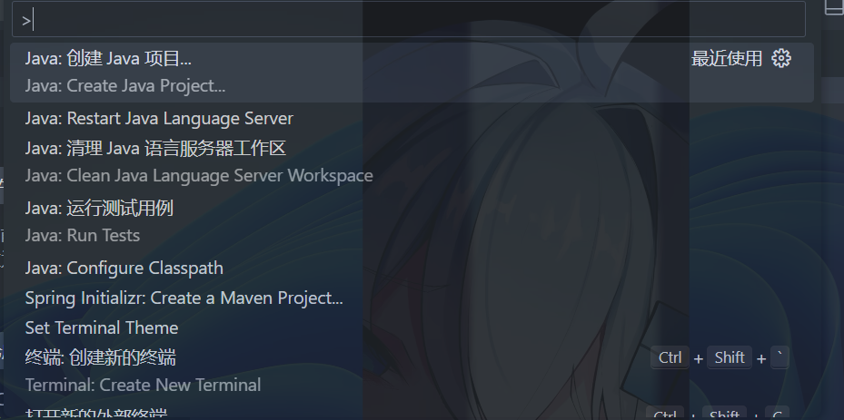

选择Spring Boot

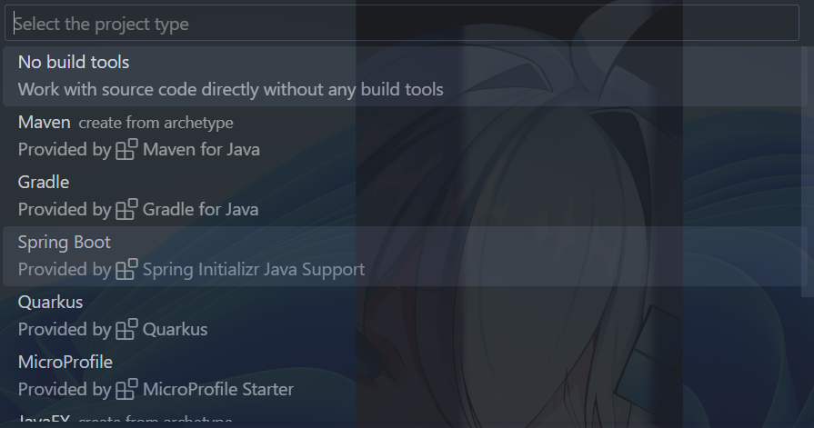

选择Maven

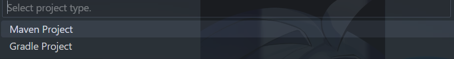

选择SpringBoot版本

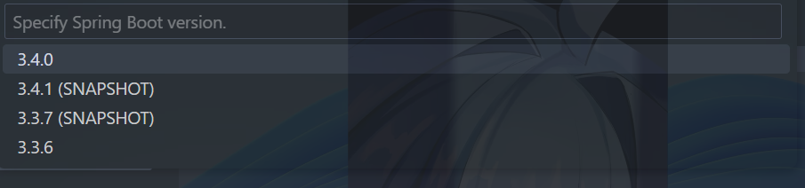

选择Java为开发语言


输入域名

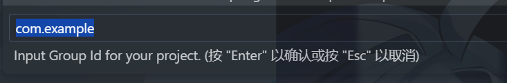

输入项目名称

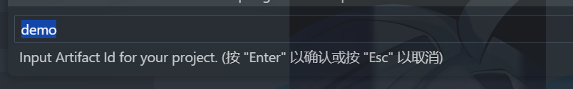

选择Jar为打包方式

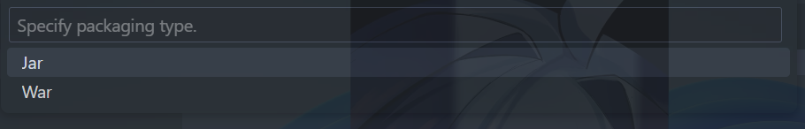

选择Java版本（根据你的情况选择）

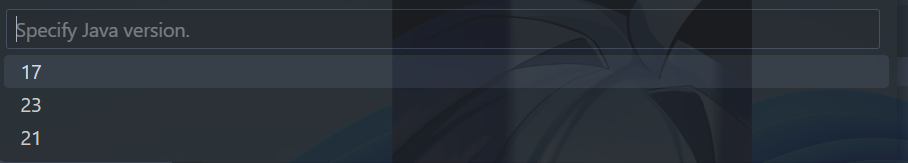

选择依赖（根据你的情况选择）

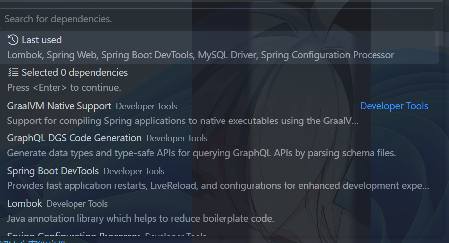
在application.properties中设置数据库连接信息

**没有配置数据库启动不了**

```bash
spring.application.name=demo
spring.datasource.url=jdbc:mysql://localhost:3306/testdb1
spring.datasource.username=root
spring.datasource.password=123456
spring.datasource.driver-class-name=com.mysql.cj.jdbc.Driver
```

点击run启动项目

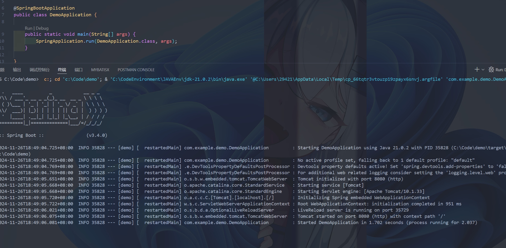

## vscode 启动Vue3项目

默认已经安装了Node.js

没装的可以上网搜教程

### 安装Vue插件

vscode 插件搜索Vue即可。

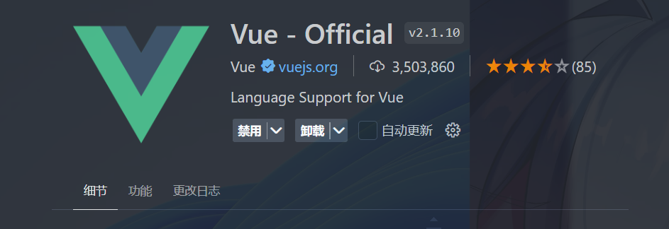

### 创建Vue3项目

按住ctrl + j打开命令行窗口 输入

```bash
npm create vue@latest
```

设置项目（这里是演示所以全选否）

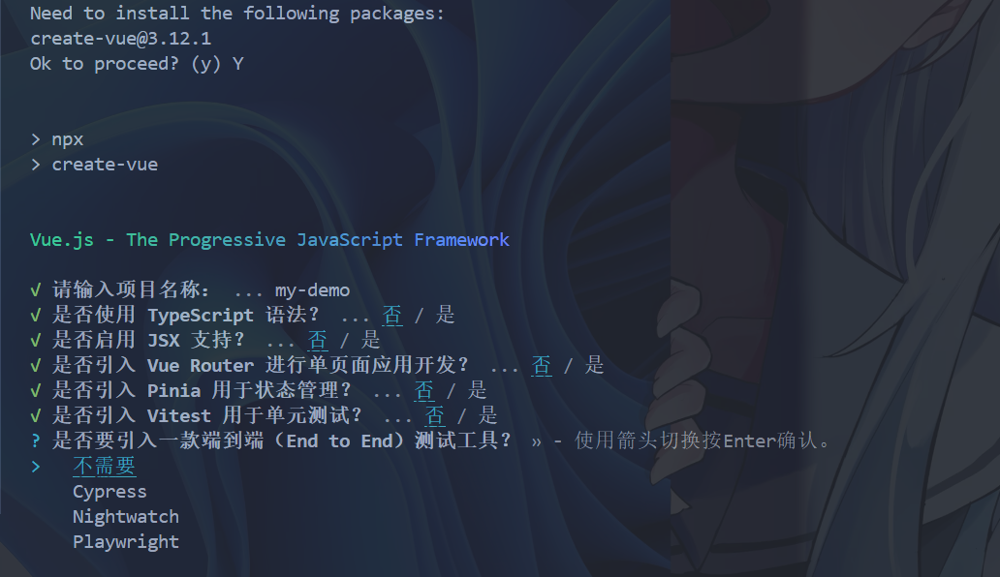

输入以下命令

```bash
cd xxx(你的目录)
npm install
npm run dev
```

打开浏览器访问http://localhost:5173/

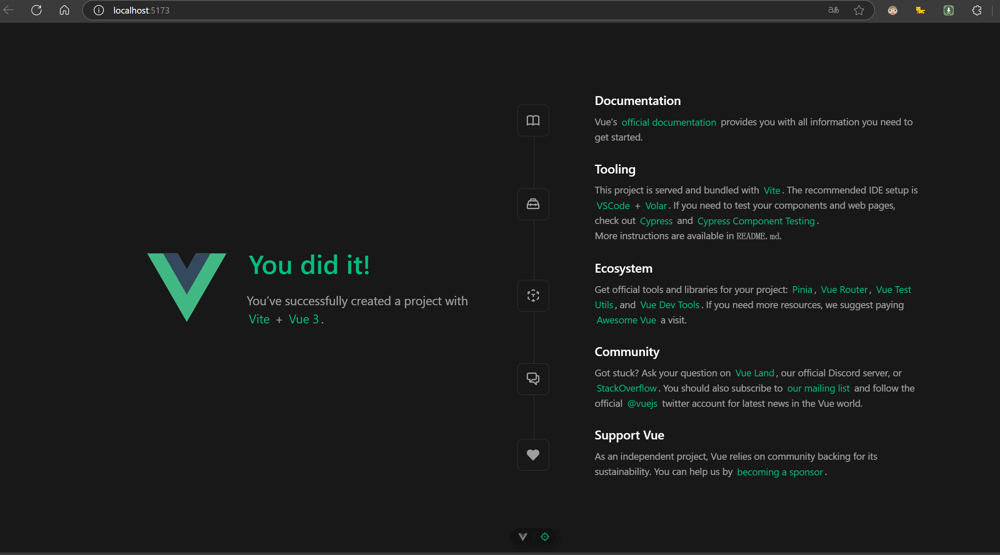