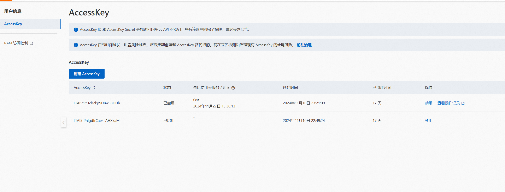
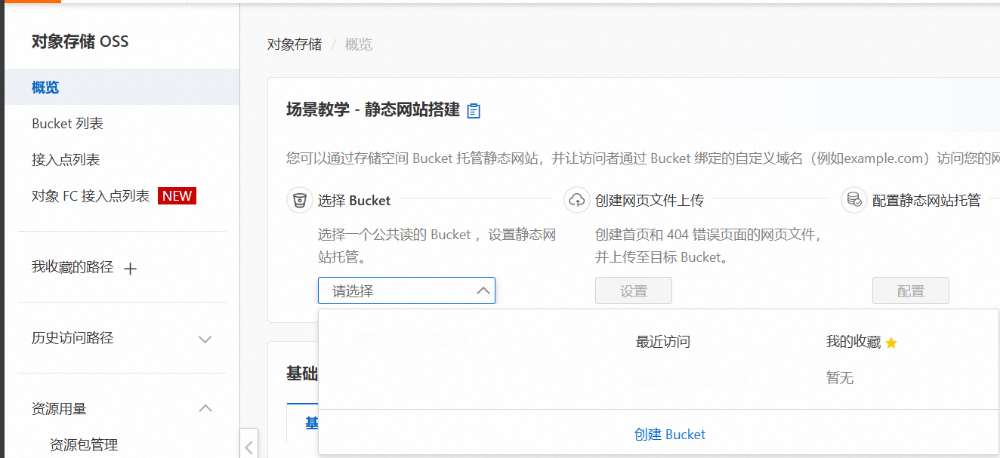
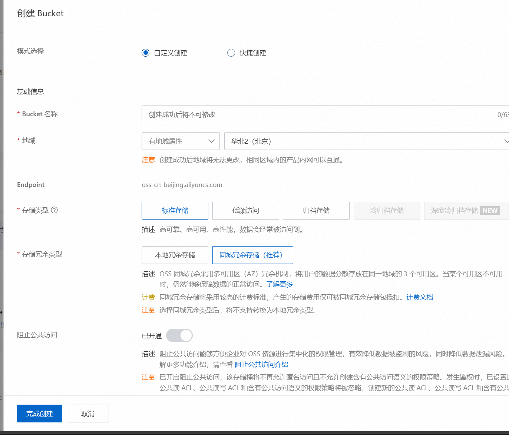
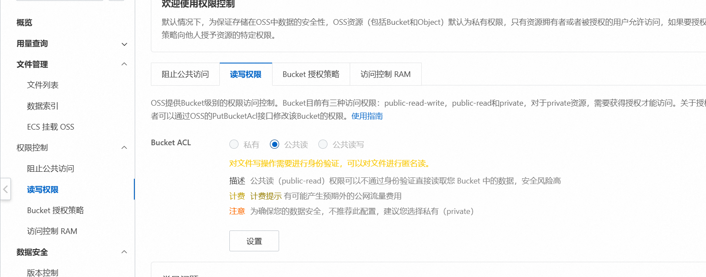

# 阿里云oss的使用

## 创建bucket

首先创建一个阿里账号，然后购买oss服务，这里使用的是新人免费（具体几个月忘记了）。

首先应该生成一个AccessKey

:::danger
必须在创建完AccessKey后就赶紧保存你的Id和Secret

过了你就查不到了
:::



接下来创建bucket



这里配置你的bucket

主要是存储类型和存储冗余类型。

我设置为低频访问和本地冗余

:::note
公开读写得创建完了才能设置
:::



## 设置公开读写

在边栏权限访问处，读写权限设置公开读写

:::note
不设置公开读写，你访问的url是有时间限制的，超过时间就无法访问
:::



## 引入依赖

maven坐标如下

```xml
<dependency>
    <groupId>com.aliyun.oss</groupId>
    <artifactId>aliyun-sdk-oss</artifactId>
    <version>3.1.0</version>
</dependency>
```

## 配置

```yml
aliyun:
    oss:
        end-point: #你的end-point 可以在概览中查到
        access-key-id: # 上面提到的AccessKey
        access-key-secret: # 上面提到的AccessSecret
        bucket-name: # 你的bucketName
```

如果你需要设置上传的文件大小，可以添加以下配置

```yml
spring:
    servlet:
        multipart:
            max-file-size: 100MB
            max-request-size: 100MB
```

```java
@ConfigurationProperties(prefix = "aliyun.oss")
@Configuration
@Data
public class OSSConfig {
    private String endPoint;
    private String accessKeyId;
    private String accessKeySecret;
    private String bucketName;
}
```

## 使用

```java
@Service
public class ImageService {
    @Autowired
    private OSSConfig ossConfig;

    public String uploadImage(MultipartFile multipartFile) throws IOException {
        String endpoint = ossConfig.getEndPoint();
        String accessKeyId = ossConfig.getAccessKeyId();
        String accessKeySecret = ossConfig.getAccessKeySecret();
        String bucketName = ossConfig.getBucketName();
        OSS ossClient = new OSSClientBuilder().build(endpoint, accessKeyId, accessKeySecret);
        // 这里是为了按照日期分文件管理
        SimpleDateFormat sdf = new SimpleDateFormat("yyyyMMdd");
        String fileName = multipartFile.getOriginalFilename();
        String suffixName = fileName.substring(fileName.lastIndexOf("."));
        String finalFileName = System.currentTimeMillis() + "" + new SecureRandom().nextInt(0x0400) + suffixName;
        String objectName = sdf.format(new Date()) + "/" + finalFileName;
        ObjectMetadata objectMetadata = new ObjectMetadata();
        objectMetadata.setContentType("image/jpg");
        // 文件上传
        ossClient.putObject(bucketName, objectName, new ByteArrayInputStream(multipartFile.getBytes()),
                objectMetadata);
        // 这里是设置过期时间，公开读写可忽略这部分。
        // 注意最大设置为7天
        // Date expiration = new Date(System.currentTimeMillis() + 7 * 24 * 60 * 60 * 1000);
        // String url = ossClient.generatePresignedUrl(bucketName, objectName, expiration).toString();
        // 设置公开读后，这串url可以直接访问图片
        String url = "https://" + bucketName + "." + ossConfig.getEndPoint() + "/" + objectName;
        ossClient.shutdown();
        return url;
    }
}
```
